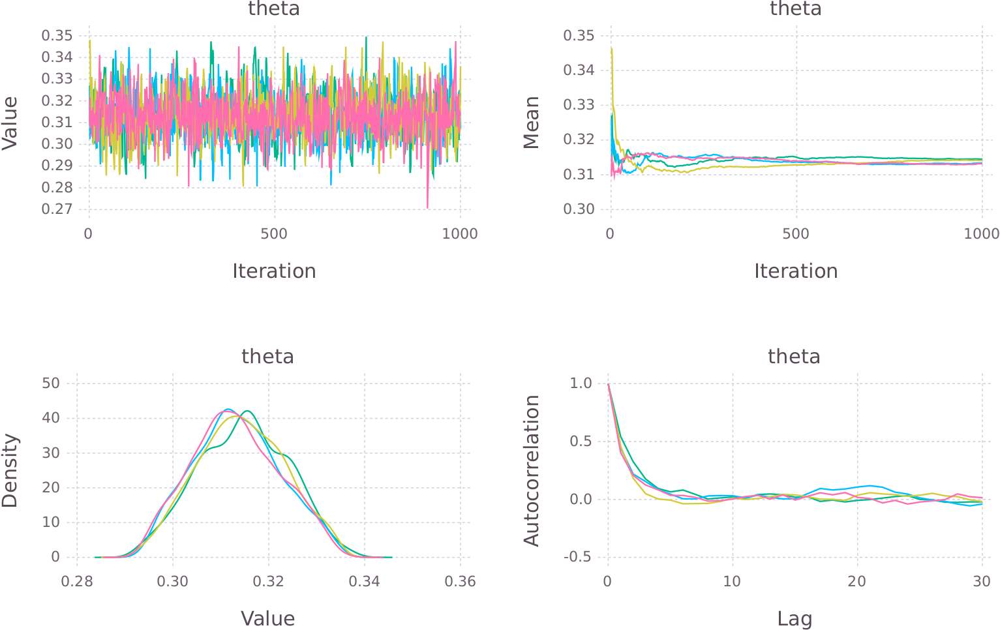

```{r setup, include=FALSE}
# knitr::opts_chunk$set(echo = TRUE)
library(dplyr)
library(stringr)
```

# {.col-1}

## Workflow

```{r, echo = FALSE}
DiagrammeR::grViz("workflow.gv")
```

# {.col-2}

## Introduction

### Background {.fullwidth}

Stan[@stan-ref] is a probabilistic programming language. It uses Markov Chain Monte Carlo (MCMC) to generate samples from the posterior distribution.

$$
p(\theta|y, X) = \frac{p(y|X, \theta) p(\theta)}{p(y)} \propto p(y|\theta) p(\theta)
$$

### Installation

The `Stan.jl` package[@stanjl-ref] provides an interface from Julia. It depends on the shell interface to Stan, `CmdStan`. Set the `CMDSTAN_HOME` environment variable to the folder in which you unpacked `CmdStan`.

```
julia> Pkg.add("Stan")
julia> using Stan
julia> using Mamba
```

## Case Study

We'll be using `Stan.jl` to analyse data gathered from a slot machine.

### Data {.fullwidth}

A sample of the data:

```
   session  spins  hits wager payout  hit_rate       rtp
 1       1      7     2    10      3 0.2857143 0.3000000
 2       2     19     7    30     29 0.3684211 0.9666667
 3       3     19     3    22      3 0.1578947 0.1363636
 4       4     26     7    30     13 0.2692308 0.4333333
 5       5     23     8    31     35 0.3478261 1.1290323
```

Wrap the salient columns in a dictionary.

```
const binomial_data = Dict("N"     => size(slots, 1),
                           "hits"  => slots[:hits],
                           "spins" => slots[:spins])
```

## The Model

<div class="fullwidth">
The Stan model can be defined as a string or in an external file.

```
const binomial_model = "
data {
  int<lower=0> N;
  int hits[N];
  int spins[N];
}
parameters {
  real<lower=0,upper=1> theta;
}
model {
  hits ~ binomial(spins, theta);       // Likelihood
  theta ~ beta(2, 2);                  // Prior
}
";
```
</div>

# {.col-2}

## Build and Run the Model

<div class="fullwidth">
```
stanmodel = Stanmodel(model=binomial_model, nchains=4);
```

```
rc, simulated = stan(stanmodel, [binomial_data]);
```

Result returned as a `Mamba.Chains`[@mamba-doc] object.
</div>

### Diagnostics {.fullwidth}

A wide range of siagnostics are available through `Mamba` to check on the convergence of the chains.

### Results {.fullwidth}

```
> describe(simulated[:, ["theta"], :], q=[0.025, 0.5, 0.975])
```
```
Empirical Posterior Estimates:
         Mean         SD        Naive SE        MCSE      ESS
theta 0.31289054 0.010642713 0.00016827606 0.00029036710 1000

Quantiles:
         2.5%      50.0%     97.5%  
theta 0.29309677 0.312797 0.33427225
```

Plots are generated using `Gadfly`[@gadfly-doc].



## Conclusion

This case study was presented in greated detail at eRum[@erum-video; @erum-slides].

## References {style="--header-color:darkred; --other-color-for-h2-gradient:red;"}

<div class="fullwidth">
This poster was created using R Markdown and `drposter`[@drposter-ref] with FontAwesome icons via `icon`[@icon-ref] and diagrams using GraphViz and `DiagrammeR`[@diagrammer-ref].
</div>

<div id="refs" class="references"></div>
